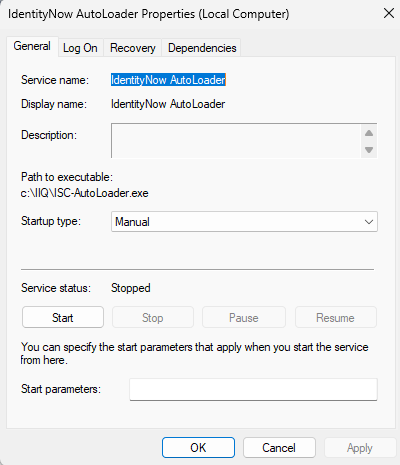
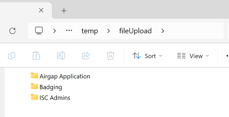
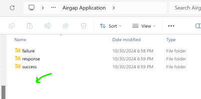
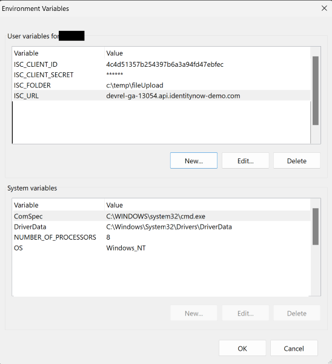
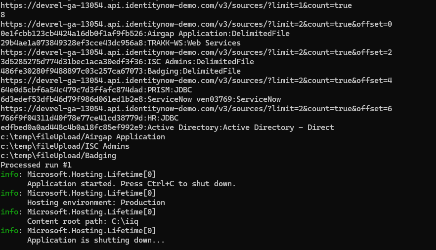
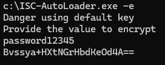

[![Discourse Topics][discourse-shield]][discourse-url]
[![Issues][issues-shield]][issues-url]
[![Latest Releases][release-shield]][release-url]
[![Contributor Shield][contributor-shield]][contributors-url]

[discourse-shield]:https://img.shields.io/discourse/topics?label=Discuss%20This%20Tool&server=https%3A%2F%2Fdeveloper.sailpoint.com%2Fdiscuss
[discourse-url]:https://developer.sailpoint.com/discuss/tag/workflows
[issues-shield]:https://img.shields.io/github/issues/sailpoint-oss/repo-template?label=Issues
[issues-url]:https://github.com/sailpoint-oss/repo-template/issues
[release-shield]: https://img.shields.io/github/v/release/sailpoint-oss/repo-template?label=Current%20Release
[release-url]:https://github.com/sailpoint-oss/repo-template/releases
[contributor-shield]:https://img.shields.io/github/contributors/sailpoint-oss/repo-template?label=Contributors
[contributors-url]:https://github.com/sailpoint-oss/repo-template/graphs/contributors

# IdentityNow AutoLoader
IdentityNow ISC AutoLoader for Delimited Files.  A simple windows service to send csv files to IdentityNow.  It also allows systemAdmins and developers the option of running a PowerShell script to alter the file before upload is sent to IdentityNow.  Another project like this is https://github.com/sailpoint-oss/colab-file-upload-utility.  Use the colab repo if you need something that runs on Linux.  But if you need something that runs as a windows service like most traditional applications this might be the right code for you.  As it runs as a windows service the "Log On" and recovery options can be helpful.  




# Reason
The non cloud version could pick up files from your local ftp system or windows box.  As a customer you could schedule the pickup and use windows file protections that you normally use to secure any of your data.  IdentityNow is on a Cloud hosted solution therefore we need to detect when a file is created from an application report and upload over https.  The assumption is that must of your on-prem applications that produce reports for compliance are set to write to a windows file system.  


## Customer Upload Process
The code will connect to your instance of IdentityNow and create folders for each application that is a delimitted Application.  Inside the folder it will create three child folders. 

For account files simply add the file into the root of the folder for your source and wait for the system to process.  For entitlement the filename must start with ent-*

1) Success (Upload got a good response from the application)
2) Failure (Upload had some type of issue)
3) Response (http response code recieved from the upload command)

As an admin you will need to set the permissions correctly if you want to prevent one application owner from adding files to the wrong folder.  The Service account that runs the windows service will need read and write access.  When the application owner copies a file into root of the Folder drop box the system will scan and see the new file.  It will upload the file to IdentityNow and then move the file into one of the child folders with the date it was processed.  



# Setup/Install
You just need to define a few user variables. And DotNot Core 8x.  Remember this only works on Windows as its a Windows Service.  If you use system variables anyone with remote desktop to your server will have access but if you use user variables on the windows service account will have access.  

1) ISC_URL = tenant.API.identitynow.com
2) ISC_CLIENT_ID = PAT_ID value
3) ISC_CLIENT_SECRET = pat password
4) ISC_FOLDER = c:\fileUpload  (This is where all the application folders will be created)



## Install as Windows Service
I recommend you follow the validate steps before installing as a service.  When you run interactively it is easer to see what is happening

```cmd
sc create "IdentityNow AutoLoader" binPath=c:\IIQ\ISC-AutoLoader.exe
```

## UnInstall Windows Service
```cmd
sc delete "IdentityNow AutoLoader"
```

# Validate and Troubleshooting
Before making this a windows service run locally to see how it works.  Just run the .exe command and you can see the processes and figure out if you have any issues such as network access issues.



```cmd 
./ISC-AutoLoader.exe
```

# Optional Configs
I tried to make this as simple as possible to get started with.  But the optional configurations should give you the ability to expand for your many use cases.

## Optional config.ini
A config.ini file will be created.  This will contain optional configuration.  It is not required.  
``` ini
# Optional if you dont want to keep the history of uploaded files
archive=false
# System will scan the file system upload and then rest.  In general this should be 60 as thats a min but in testing you can drop this or increase as you need
delayScanPerSecond=120
# I dont know much about this as I have not tried very big files but if you get timeouts try updating this number in Minutes
restTimeOut=10
#Basic encryption if you dont want to store the ISC_CLIENT_SECRET in plan text set a key and follow the commands to encrypt your secret.
EncryptKey=b14ca5898a4e4133bbce2ea2315a1916
# By default the autoloader will only allow for delimited file connections but if you need to bring in all sources for things like entitlement uploads you can add a true statement.  If you have limitList and true limitList takes priority.
allSources=true
# If you only want a subset of the applications instead of all delimited apps.  You should likely have this set if you have allSources=true
limitList=Badging, ISC Admins
``` 

## Optional File Locking
Some larger files may take time to be ftp'ed to your file server where the program is watching for.  If this is the case have the source pushing the file to your server create afile with the same name but with extention .lck or .lock.  Before pushing the file, This will tell the scanner that the file is open and not ready to upload.  Once done have that source pushing the file delete the .lck file.

## Optional Commands

```cmd 
REM shows version number
./ISC-AutoLoader.exe -v
```

Just one more option if you want to store the ISC_CLIENT_SECRET so that someone needs access to your config.ini and the evn variable.  

```cmd 
REM encrypt a string
./ISC-AutoLoader.exe -e
```


# PreProcess Files with PowerShell
For the old school IIQ developers this is the PreIterate function.  If you are migrating from IIQ you can even run most of your Beanshell PreIterate rules this way with a bit of performance cost.  An Example beanshell rule is provided.  (Remember you dont have all the jars for identityiq)  Example assume the report has a header or footer that you need to remove before sending it to IdentityNow.  Then you can now use PS commands to alter the file and format it correctly.  Reformating the file in UT8 is also an example script in the repo.

To use a ps1 script to customize your file you must add the file to the /commands folder of root of your storage.  **Make sure you PROTECT this folder with good Windows File Permissions**.  The powershell script name must match the applicationName (Application Folder).

Make sure you have setup the level of protection you want for PS commands on your box. 

If you return values or write out data you should see the results of your ps script found  in app/results/ps_{date}_fileName.log


https://learn.microsoft.com/en-us/powershell/module/microsoft.powershell.security/set-executionpolicy?view=powershell-7.4

```ps1
param ($ApplicationName, $ApplicationID, $rootFolder, $fileName)
#Simple concept clearly your code will be more complex...
(Get-Content $fileName).Replace('sailpointdemo.com', "customer.com") | Set-Content $fileName
```

Testing locally pass in 4 attributes and make sure your script does not hang.  Remember that this is your code that must finish before the application can continue.  If you see the system hanging it might be a bad PS script.  
```cmd
c:\temp\fileUpload\commands\Badging.ps1 -ApplicationID "123456" -ApplicationName "Badging"
```

Hope this helps the community.  I have never tested it underload but its a very simple process.  If you run into load issues let me know the errors.    
Jed

[New to the CoLab? Click here »](https://developer.sailpoint.com/discuss/t/about-the-sailpoint-developer-community-colab/11230)

<!-- CONTRIBUTING -->
## Contributing

Contributions are what make the open source community such an amazing place to learn, inspire, and create. Any contributions you make are **greatly appreciated**.

If you have a suggestion that would make this better, please fork the repo and create a pull request. You can also simply open an issue with the tag `enhancement`.
Don't forget to give the project a star! Thanks again!

1. Fork the Project
2. Create your Feature Branch (`git checkout -b feature/AmazingFeature`)
3. Commit your Changes (`git commit -m 'Add some AmazingFeature'`)
4. Push to the Branch (`git push origin feature/AmazingFeature`)
5. Open a Pull Request

<!-- LICENSE -->
## License

Distributed under the MIT License. See `LICENSE.txt` for more information.

<!-- CONTACT -->
## Discuss
[Click Here](https://developer.sailpoint.com/dicuss/tag/{tagName}) to discuss this tool with other users.
